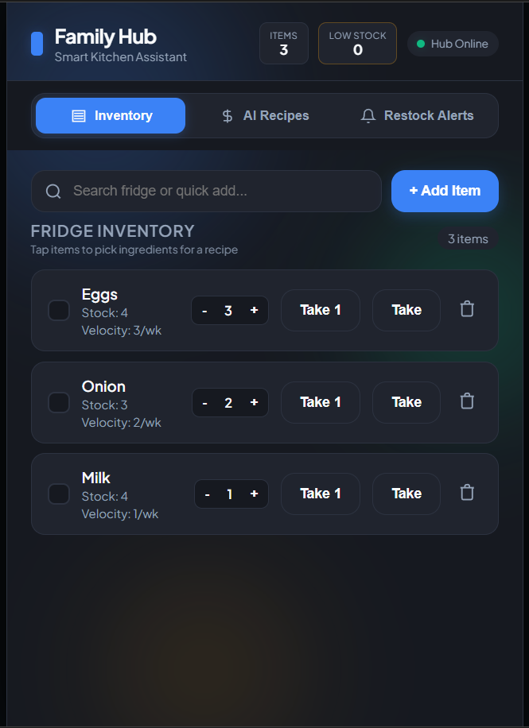
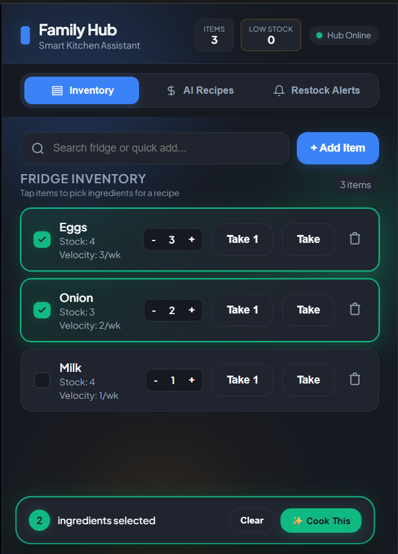
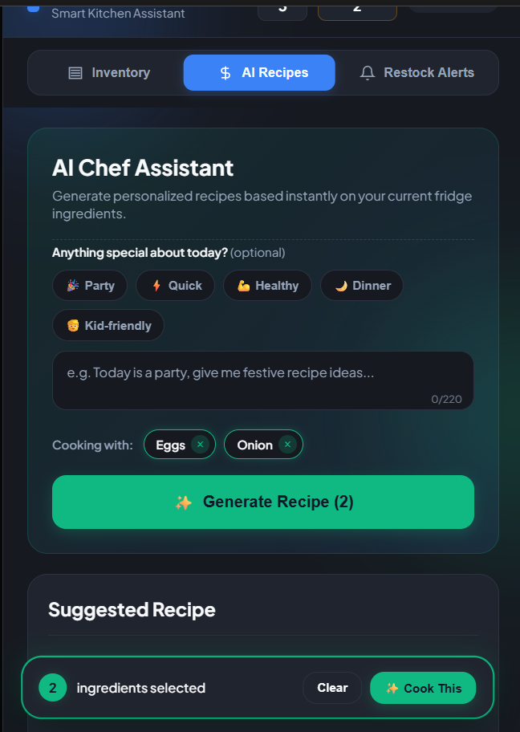
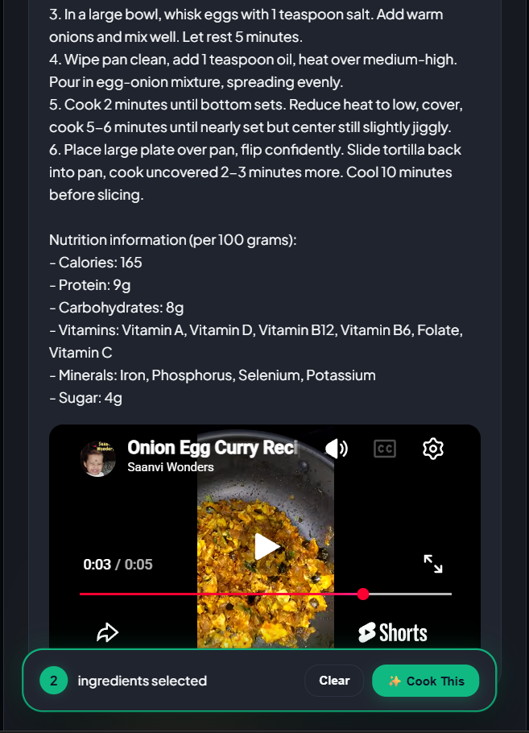
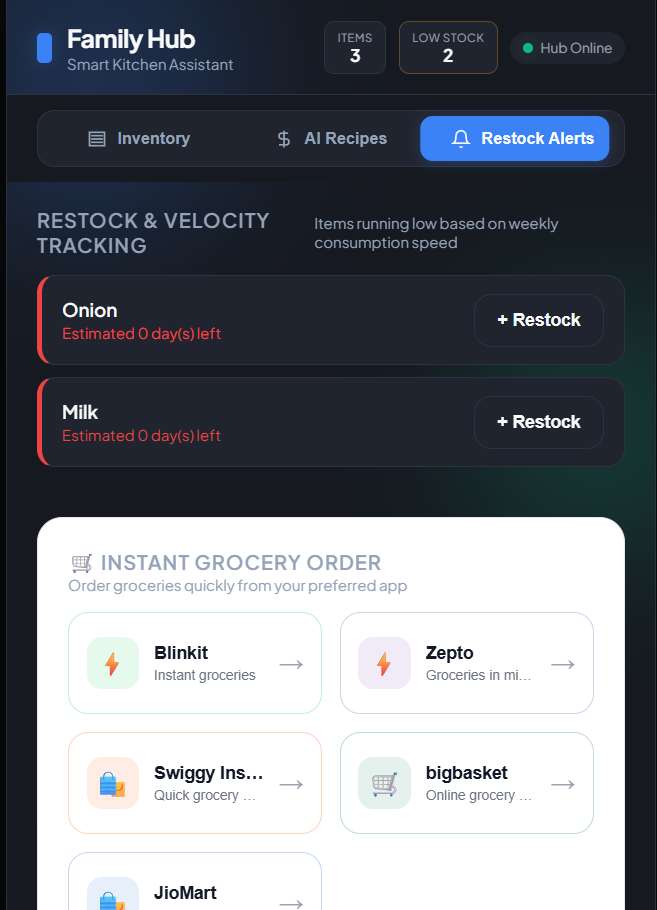
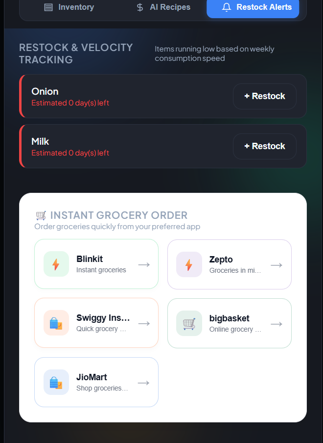

# 🧊 Smart Fridge AI Ecosystem

> **An intelligent kitchen assistant that turns your fridge inventory into smarter meals, smarter shopping, and smarter decisions.**

[](https://www.python.org/)
[](https://fastapi.tiangolo.com/)
[](https://openrouter.ai/)
[](https://docs.pydantic.dev/)
[]()

**Smart Fridge AI Ecosystem** is an AI-powered smart kitchen management platform designed to help users understand what is inside their fridge, track consumption, predict when items will run out, generate recipes based on available ingredients and occasions, and quickly find grocery options for restocking.

Instead of treating a refrigerator as just a list of items, the project turns inventory data into an **intelligent kitchen assistant**.

---

## ✨ What It Does

Smart Fridge AI connects **inventory management + consumption tracking + AI recipes + predictive restocking + grocery discovery** into one dashboard.

### 🧊 Smart Inventory

Keep your fridge inventory organized and up to date.

* ➕ Add new items
* 🔢 Track quantities
* ➖ Consume items and automatically decrease quantity
* 🗑️ Delete items
* 🔎 Search inventory
* 📊 View inventory statistics
* ⚡ Track weekly consumption velocity

### 🤖 AI Recipe Generator

Turn your available ingredients into meals.

The AI can generate recipes using your current inventory and can adapt recipe suggestions according to the **occasion**.

For example:

* 🍳 Everyday breakfast
* 🍛 Lunch
* 🍽️ Dinner
* 🎉 Special occasions
* 👨‍👩‍👧 Family meals
* 🥗 Quick meals
* 🍰 Dessert ideas

The goal is simple:

> **Tell the system what you have — let AI figure out what you can make.**

### 📈 Predictive Restocking

The system doesn't only tell you that something is low.

It uses consumption velocity to estimate which items may run out and helps identify products that should be restocked.

Features include:

* Weekly consumption tracking
* Low-stock detection
* Consumption velocity
* 7-day restocking prediction
* Restock alerts
* Quick reorder options

### 🛒 Grocery Discovery

When an item needs to be restocked, users can quickly access supported grocery platforms.

The Restock section provides convenient links to grocery services so users can continue their shopping journey without manually searching for every product.

### 📺 Recipe Tutorials

Generated recipes can be paired with relevant **YouTube cooking tutorials**, making it easier to move from:

**Ingredient → Recipe → Tutorial → Cooking**

### 📊 Smart Dashboard

A centralized dashboard provides an overview of the kitchen.

It can display information such as:

* Total inventory
* Low-stock items
* Restock alerts
* Consumption velocity
* System status
* AI recipe generation

---

# 🧠 How It Works

```text
                 ┌─────────────────────┐
                 │    User Inventory   │
                 └──────────┬──────────┘
                            │
                            ▼
                 ┌─────────────────────┐
                 │ Inventory Management│
                 └──────────┬──────────┘
                            │
                 ┌──────────┴──────────┐
                 ▼                     ▼
        ┌─────────────────┐   ┌─────────────────┐
        │ Consumption      │   │ AI Recipe Engine│
        │ Tracking         │   │   OpenRouter    │
        └────────┬─────────┘   └────────┬────────┘
                 │                      │
                 ▼                      ▼
        ┌─────────────────┐    ┌─────────────────┐
        │ Velocity &      │    │ Occasion-based  │
        │ Prediction      │    │ Recipe Ideas    │
        └────────┬────────┘    └─────────────────┘
                 │
                 ▼
        ┌─────────────────┐
        │ Restock Alerts  │
        └────────┬────────┘
                 │
                 ▼
        ┌─────────────────┐
        │ Grocery Apps /  │
        │ Quick Reorder   │
        └─────────────────┘
```

---

# 🏗️ Architecture

```text
┌──────────────────────────────────────────────┐
│                  FRONTEND                    │
│                                              │
│  HTML + CSS + JavaScript                    │
│  Responsive 21:9 Smart Dashboard            │
└──────────────────────┬───────────────────────┘
                       │
                       │ REST API
                       ▼
┌──────────────────────────────────────────────┐
│                 FASTAPI                      │
│                                              │
│  API Routes                                  │
│  Business Logic                              │
│  Validation                                  │
│  AI Integration                              │
│  Inventory Operations                        │
└──────────────┬───────────────┬───────────────┘
               │               │
               ▼               ▼
      ┌────────────────┐  ┌──────────────────┐
      │   Database     │  │   OpenRouter     │
      │                │  │                  │
      │ SQL / Data     │  │ AI Recipe        │
      │ Persistence    │  │ Generation       │
      └────────────────┘  └──────────────────┘
                               │
                               ▼
                       ┌──────────────────┐
                       │   YouTube API    │
                       │                  │
                       │ Recipe Tutorials │
                       └──────────────────┘
```

---

# 🛠️ Tech Stack

## Frontend

* **HTML5**
* **CSS3**
* **JavaScript**
* Responsive dashboard interface
* 21:9 optimized UI

## Backend

* **Python 3.12+**
* **FastAPI**
* **Pydantic**
* REST APIs
* JSON
* SQL/database integration

## AI

* **OpenRouter**
* AI-powered recipe generation
* Occasion-based recipe recommendations

## Integrations

* **YouTube API** — cooking tutorial discovery
* Grocery platforms — quick restocking links

---

# 📁 Project Structure

```text
smart-fridge-ai/
│
├── backend/
│   ├── main.py
│   ├── database.py
│   ├── schemas.py
│   ├── requirements.txt
│   └── .env.example
│
├── frontend/
│   ├── index.html
│   ├── style.css
│   └── app.js
│
└── README.md
```

---

# 🚀 Getting Started

## Prerequisites

Make sure you have:

* Python **3.12 or newer**
* Git
* A modern web browser
* OpenRouter API key
* YouTube Data API key

---

## 1. Clone the Repository

```bash
git clone YOUR_GITHUB_REPOSITORY_URL
cd smart-fridge-ai
```

---

## 2. Create a Virtual Environment

### Windows

```bash
python -m venv venv
venv\Scripts\activate
```

### macOS / Linux

```bash
python3 -m venv venv
source venv/bin/activate
```

---

## 3. Install Dependencies

```bash
cd backend
pip install -r requirements.txt
```

---

## 4. Configure Environment Variables

Create a `.env` file inside the `backend` directory.

```env
OPENROUTER_API_KEY=your_openrouter_api_key
YOUTUBE_API_KEY=your_youtube_api_key
DATABASE_URL=your_database_url
```

> ⚠️ Never commit your `.env` file or expose API keys publicly.

---

## 5. Start the Backend

```bash
uvicorn main:app --reload --port 8000
```

The API will be available at:

```text
http://localhost:8000
```

FastAPI documentation:

```text
http://localhost:8000/docs
```

---

## 6. Start the Frontend

Open:

```text
frontend/index.html
```

in your browser.

The frontend communicates with the FastAPI backend running on port `8000`.

---

# 🔌 API Endpoints

| Method   | Endpoint                   | Description                  |
| -------- | -------------------------- | ---------------------------- |
| `GET`    | `/api/items`               | Get inventory                |
| `POST`   | `/api/add-item`            | Add or increment an item     |
| `DELETE` | `/api/items/{id}`          | Delete an item               |
| `PATCH`  | `/api/items/{id}/velocity` | Update consumption velocity  |
| `PATCH`  | `/api/items/{id}/consume`  | Consume an item              |
| `POST`   | `/api/generate-recipe`     | Generate an AI recipe        |
| `GET`    | `/api/restock-alerts`      | Get predicted restock alerts |

---

# 🍳 Example Workflow

Imagine your fridge contains:

```text
🥚 Eggs       × 12
🥛 Milk       × 2
🍅 Tomatoes   × 5
🧀 Cheese     × 1
```

You consume 2 eggs.

The inventory automatically becomes:

```text
🥚 Eggs       × 10
```

As consumption continues, the system tracks the user's velocity and can identify items that may need restocking.

At the same time, the AI can use the available ingredients to suggest recipes.

```text
       Your Fridge
            │
            ▼
      Available Items
            │
       ┌────┴────┐
       ▼         ▼
   AI Recipe   Consumption
       │         Tracking
       ▼           │
   Meal Idea       ▼
              Restock Alert
                   │
                   ▼
             Grocery Links
```

---

# 🎯 Project Goals

Smart Fridge AI is designed around four major goals:

### 1. Reduce Food Waste

Help users understand what they have before buying more.

### 2. Make Cooking Easier

Generate useful recipes from ingredients that are already available.

### 3. Predict Restocking Needs

Use consumption patterns instead of relying only on manual reminders.

### 4. Simplify Grocery Shopping

Connect restock alerts with convenient grocery shopping options.

---

# 🔮 Future Roadmap

The project is currently **almost complete**, with the core ecosystem implemented.

Potential future improvements:

* [ ] User authentication
* [ ] Multiple household profiles
* [ ] Expiry-date prediction
* [ ] Food-waste analytics
* [ ] Barcode scanning
* [ ] Image-based food recognition
* [ ] Voice-controlled kitchen assistant
* [ ] Personalized nutrition preferences
* [ ] Advanced consumption forecasting
* [ ] Automated grocery cart generation
* [ ] Mobile application
* [ ] Cloud deployment
* [ ] IoT/smart refrigerator integration

---

# 🔐 Security

API credentials should always be stored in environment variables.

```text
.env
```

should **never** be committed to GitHub.

Use:

```text
.env.example
```

to show the required configuration without exposing secrets.

---

# 📸 Screenshots


[Inventory]

[Inventory_selected]

[AI_Recipes]

[Youtube]

[Restock_tab]

[Instant_tab]

# 🗺️ Current Status

**🟢 Almost Complete**

The major functionality is implemented, including:

* Inventory management
* Quantity tracking
* Consumption tracking
* Velocity tracking
* Low-stock alerts
* Predictive restocking
* AI recipe generation
* Occasion-based recipes
* YouTube tutorial discovery
* Grocery service links
* Smart dashboard

---

# 🤝 Contributing

Contributions, suggestions, and improvements are welcome.

If you would like to contribute:

```bash
git fork
git clone
git checkout -b feature/your-feature
```

Make your changes, test them, and submit a pull request.

---

# 📄 License

This project is available under the terms of the license included in this repository.

---

# 👨‍💻 Author

**Aditya Chavan**

Building intelligent software experiences at the intersection of:

**AI × Software × Smart Systems**

---

<div align="center">

### 🧊 Smart Fridge AI Ecosystem

**Your fridge knows what you have.
AI helps you decide what to do with it.**

⭐ If you find this project interesting, consider giving it a star.

</div>
